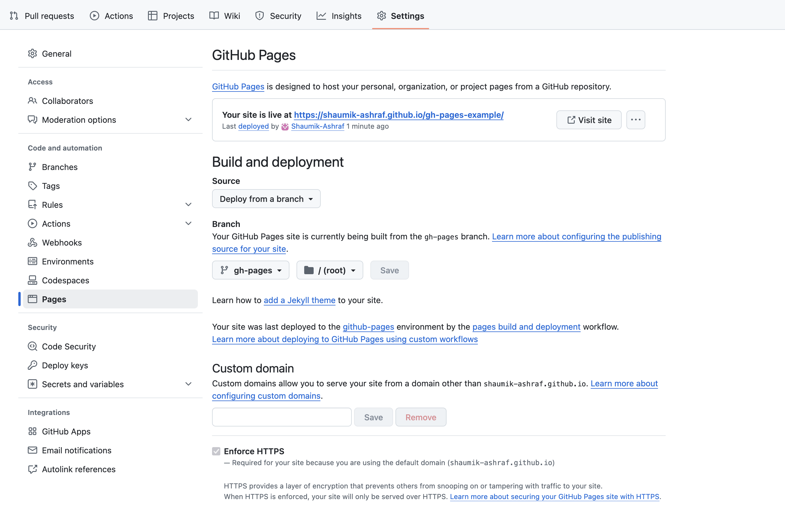
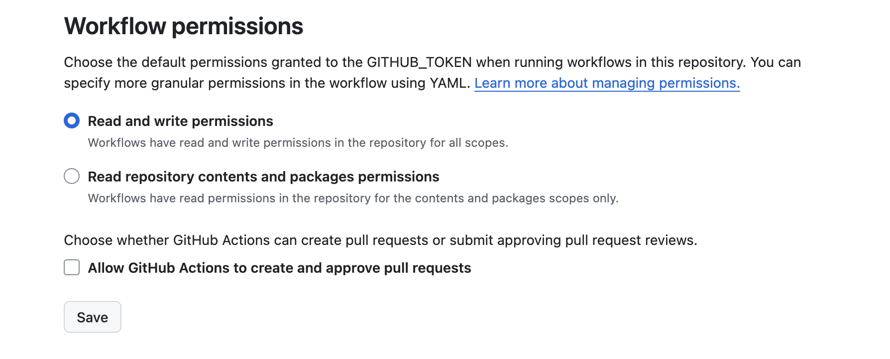

# FHIR for Research

GitHub Actions automatically builds commits to the `main` branch to <https://nih-odss.github.io/fhir-for-research>.

----

## Dependencies

- [Quarto v1.6.40](https://github.com/quarto-dev/quarto-cli/releases/tag/v1.6.40) ([see guides](https://quarto.org/))
- [R](https://www.r-project.org/)
- [Python3](https://www.python.org/) and [Jupyter](https://jupyter.org/)
- [uv](https://docs.astral.sh/uv/) package manager
- [Docker](https://www.docker.com/)

# Development

## Running Locally

- For first time setup only:
  + If running mac or linux: follow setup-mac.qmd
  + If running windows: follow setup-windows.qmd
  + If you want to use your system SSL/TLS certificates, add `UV_NATIVE_TLS=true` to the environment
- Start the provided FHIR server: `docker compose -f fhir-server/docker-compose.yml up -d`
- For first time setup, upload data to the FHIR server: `uv run ./script/load_data.py`
  + The server takes a few minutes to start the first time, so the script may fail if its executed immediately. Running the script multiple times will not duplicate data.
  + For more commands for the FHIR server, see [Running the Local FHIR Server](#running-the-local-fhir-server).
- Run `uv run quarto preview`
  + This will build the app, launch the web server, and open it in a browser
- When you are finished with development:
  + Press `Ctrl-c` to close the Quarto web server.
  + Run `docker compose -f fhir-server/docker-compose.yml down` to close the FHIR server.

## Running the Local FHIR Server

The local FHIR server is based off the [HAPI FHIR Server](https://hapifhir.io/). It's configured to run at <http://localhost:8080> by default. All the commands below must be run from within the fhir-server folder. This application hooks into the FHIR Server via the `FHIR_SERVER` environment variable set in the \_environment file. Overriding `FHIR_SERVER` will allow this application to compile against another FHIR Server, replacing the FHIR Server URL and queries in the content appropriately, but the new FHIR Server must contain the data in ./fhir-data/ and support all necessary operations.

Start the FHIR server, this may take a few minutes:
```
cd ./fhir-server   # Enter fhir-server/ folder
docker compose up
```

Close the server with Ctrl-C. If you started the server with `-d` then its running in the background, and needs to be closed with the stop server command below.

<a name="upload-data"></a>
Upload data from the fhir-data folder, this may take a few minutes:
```
# From project root folder
FHIR_SERVER=http://localhost:8080/fhir uv run ./script/load_data.py
```

Continuously view the server logs with:
```
# From fhir-server/ folder
docker compose logs --follow
```

Close the logs with Ctrl-C.

Stop the server with:
```
# From fhir-server/ folder
docker compose down
```

Reset the database and any loaded data with:
```
# From fhir-server/ folder
rm ./db/h2*
```

## Using UV Dependency Manager

The tool `uv` supports a [pip interface](https://docs.astral.sh/uv/pip/), so it can work with familiar tools such as `pip3` and `virtualenv`. You can activate a Python environment:

- For mac or linux: `source .venv/bin/activate`
- For windows: `.venv\Scripts\activate`

This allows you to remove prefixing `uv run` to commands.

To add a dependency via uv:
```sh
uv add <package>
```

## Using Quarto

[Quarto](https://quarto.org/) is a framework that integrates Python, Jupyter, R, Markdown, and more to compile static websites, presentations, and workshops. Workshops are compiled to both HTML and Jupyter Notebook format. You must have the [local FHIR server](#local-fhir-server) running to compile this application. Compile by running:

```
uv run quarto render
```

This application is not using the Quarto Execution Freeze feature, and instead executes all code at compile time to validate the content. See more about [Quarto's Managing Execution guide](https://quarto.org/docs/projects/code-execution.html) for more details on options.

This application is also not using Shiny or Quarto scripts.

Run `uv run quarto --help` to see Quarto's full CLI.

## Checking for Broken Links

This website contains a number of links to external websites. To identify broken links, the [linkchecker](https://linkchecker.github.io/linkchecker/) can be used:

```sh
linkchecker https://nih-odss.github.io/fhir-for-research/
```

To use a custom SSL certificate chain, modify `~/.config/linkchecker/linkcheckerrc` to set `sslverify` to the path of the `.crt` file.

## Checking for Orphan Pages

Orphan pages are standalone pages on a website that have no links leading to them from other parts of the site. Essentially, without the direct URL, a user cannot find these pages. In addition, because search engine crawlers depend on following links from one page to another to index a site, they usually can't discover and index these orphan pages.

To identify them, run the following command:

```sh
uv run python scripts/find_orphan_pages.py
```

----

# Deployment

## GitHub Pages

This web application comes with a GitHub Actions workflow that relies on classic GitHub Pages to deploy. In order to enable this feature you must go to Settings &rarr; Pages and select "Deploy from a Branch."



You must also go to Settings &rarr; Actions &rarr; General, scroll to Workflow permissions, and select Read and Write permissions.



Once these settings are enabled GitHub should automatically deploy this application. You can also go to Actions &rarr; Quarto Publish GitHub Pages and select "Run Workflow" from branch "main" to manually trigger a deployment. This website deploys at <https://nih-odss.github.io/fhir-for-research>.

Any non-main branches will also be automatically deployed to https://nih-odss.github.io/fhir-for-research/branches/BRANCH_NAME, where BRANCH_NAME is replaced accordingly.

Any forks of this repository will also replace the organization (NIH-ODSS) and repository name (fhir-for-research) accordingly. See [documentation on GitHub Pages](https://docs.github.com/en/pages) for more information.

## Generic Instructions

To deploy this static web application on any platform follow these rough guidelines:

 1. Follow the [running locally](#running-locally) section to setup project dependencies. You can use .github/workflows/quarto.yml or .gitlab-ci.yml as reference for a CI/CD pipeline.
 2. Optional: You can replace the FHIR Server provided in this repository with any other one by setting the `FHIR_SERVER` environment variable. The new FHIR server must have the data in ./fhir-data/ uploaded. The script ./script/load_data.py can upload the data if the new FHIR server supports FHIR Transactions and Update as Create. Replacing `FHIR_SERVER` will update the text and code execution of this web application.
 3. Update the URLs in \_quarto.yml and \_environment for your intended URL.
 4. Run `uv run quarto render` which will compile the web application to public/.
 5. Deploy the contents of the public/ folder as you would for any static website.

## Environment

All of our critical environment variables are listed in the \_environment file which is [autoloaded by Quarto](https://quarto.org/docs/projects/environment.html). Note non-quarto commands like `uv run ./script/load_data.py` will not autoload it, so it is necessary to export the `FHIR_SERVER` environment variable or prepend its value to the command (i.e: `FHIR_SERVER=http://example.com/fhir uv run ...`).

There are also some global configuration values in \_quarto.yml which the scripts do not depend on but your deployment might. See the [Quarto documentation](https://quarto.org/docs/projects/quarto-projects.html#project-metadata) for more details.

----

## License

Copyright 2023-2025 The MITRE Corporation

Licensed under the Apache License, Version 2.0 (the "License");
you may not use this file except in compliance with the License.
You may obtain a copy of the License at

    http://www.apache.org/licenses/LICENSE-2.0

Unless required by applicable law or agreed to in writing, software
distributed under the License is distributed on an "AS IS" BASIS,
WITHOUT WARRANTIES OR CONDITIONS OF ANY KIND, either express or implied.
See the License for the specific language governing permissions and
limitations under the License.

----

MITRE: Approved for Public Release / Case #24-3701
